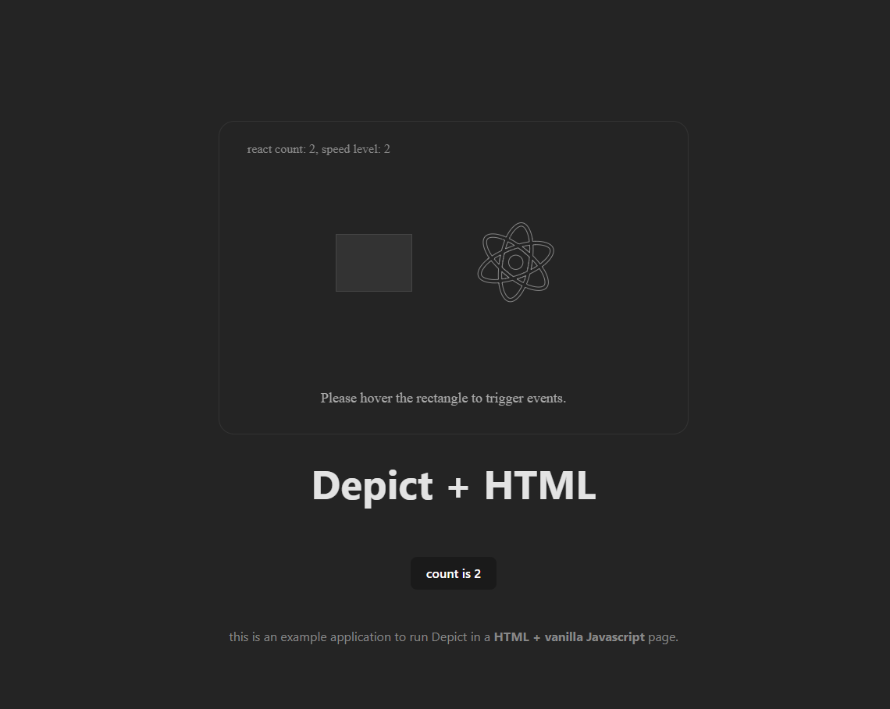

# react-graph

This is an example app which shows how to use depict with pure HTML and Javascript.  
The shapes are generated from npm package [@pattaya/pather](github.com/challenai/pather).
The boilerplate of this project is generated by vite.js.



## Quick Start 

you can run the application with the following steps.

```shell
npm install
```

```shell
npm run dev
```

## License

MIT